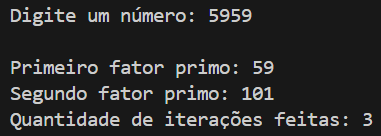
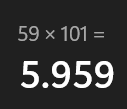
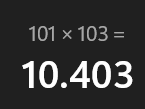
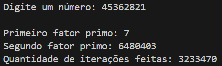

# Fatoração de Fermat
Nome: Luana de Jesus Lima - 2º ano - Sistemas de Informação - Inteli

## Print de 2 exemplos de aplicação do algoritmo de Fermat
### Exemplo 1: 5959

    
Figura 1 - Usando o algoritmo de Fermat no número 5959

    
    
Fonte: material retirado do Visual Studio Code pela autora (2026).

 

    
Figura 2 - Prova real do algoritmo de Fermat no número 5959

    
    
Fonte: material retirado da calculadora do Windows pela autora (2026).

   

### Exemplo 2: 10403

    
Figura 3 - Usando o algoritmo de Fermat no número 10403

    
    
Fonte: material retirado do Visual Studio Code pela autora (2026).

 

    
Figura 4 - Prova real do algoritmo de Fermat no número 10403

    
    
Fonte: material retirado da calculadora do Windows pela autora (2026).

## Aplicação em Criptografia
### Resposta da letra a)

    
Quadro 1 - comparando os sistemas A e B 

| **Sistema** | **Fator p**                                                                  | **Fator q** | **Nº de iterações**                                                                                                                                                                                                                                                                |
| --------------------------------- | --------------------------------------------------------------------------------------- | ------------------------------------------------------------------------------------------------------------------------------------------------------------------------------------------------------------------------------------------------------------------------------------------------------------------- | ----------------------------------------------------------------------------------------------------------- |
| Sistema A (n = 8051)                                 |83|97| 1
| Sistema B (n = 10403)                                | 101                                 | 103|1                                             

Fonte: material produzido pela autora com base no material de professora de matemática (2026).

### Resposta da letra b)
O sistema mais vulnerável a ataque é o sistema A, uma vez que tanto p quanto q do sistema A possuem menos dígitos que p e q do sistema B, o que torna mais fácil de fatorar o sistema A e atacá-lo. Além disso, o número n 10403 (chave do sistema B) é maior que 8051 (chave do sistema A), o que torna o seu processo de fatoração mais demorado e computacionalmente mais caro, o que traz mais segurança ao sistema B. 

### Resposta da letra c)
Escolher p e q muito distantes entre si torna a fatoração por Fermat computacionalmente inviável porque gera valores de chaves n muito altos que, consequentemente, são muito mais difíceis de serem fatorados no que se refere ao poder computacional tradicional. É evidente que a computação quântica quebra esse cenário, porém, como mencionado anteriormente, o fato de p e q serem muito distantes entre si e serem multiplicados para gerarem a chave n dificulta o processo de fatoração, gerando maior segurança. A seguir segue um exemplo dessa discrepância, em que p = 7 e q = 6480403, gerando n = 45362821:

    
Figura 5 - Testando p e q bem distantes entre si

    
    
Fonte: material retirado do Visual Studio Code pela autora (2026).

                                                                                                                        
